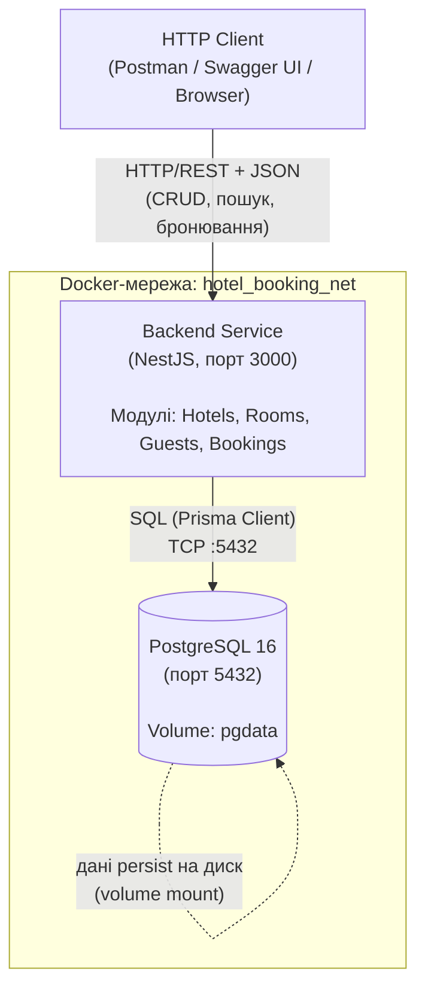
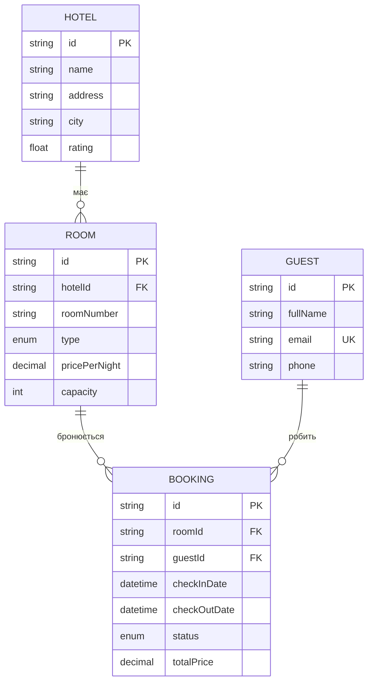

# Hotel Booking System

Прототип розподіленої/модульної системи бронювання номерів у готелі.
Лабораторна робота №1 — System Design.

## Зміст

- [Технологічний стек](#технологічний-стек)
- [Архітектура](#архітектура)
- [Доменна модель](#доменна-модель)
- [Специфікація API](#специфікація-api)
- [Інструкція із запуску](#інструкція-із-запуску)
- [Перевірка персистентності даних](#перевірка-персистентності-даних)
- [RACI-матриця](#raci-матриця--розподіл-відповідальності)
- [Bottleneck Analysis](#bottleneck-analysis)

---

## Технологічний стек

| Шар | Технологія |
|---|---|
| Backend Framework | NestJS (TypeScript) |
| ORM | Prisma 6 |
| СУБД | PostgreSQL 16 |
| Валідація | class-validator / class-transformer |
| API-документація | Swagger (OpenAPI 3.0) |
| Контейнеризація | Docker, docker-compose |

---

## Архітектура

### C4 Model — Container Diagram



### Опис компонентів

- **Backend Service (NestJS)** — сервісний шар, що обробляє HTTP-запити, виконує валідацію вхідних даних, бізнес-логіку (перевірку конфлікту бронювань, розрахунок вартості) та звертається до БД через Prisma Client.
- **PostgreSQL** — первинне реляційне сховище даних. Дані зберігаються на persistent volume (`pgdata`), що забезпечує збереження стану при перезапуску контейнера.
- **Мережа `hotel_booking_net`** — ізольована bridge-мережа Docker, через яку `api` звертається до `db` за іменем сервіса (`db:5432`), без прив'язки до `localhost`.
- Зовнішні інтеграції та черги повідомлень — відсутні в поточній версії (MVP-архітектура без асинхронної обробки).

### API-документація (Swagger/OpenAPI)

Після запуску доступна за адресою:
```
http://localhost:3000/api/docs
```

---

## Доменна модель

### Сутності та зв'язки



- **Hotel → Room**: один готель має багато номерів (1:N)
- **Room ↔ Guest через Booking**: фактичний зв'язок M:N — один номер може мати багато бронювань різних гостей у різні періоди, один гість може бронювати багато номерів
- **Бізнес-правило**: один `Room` не може мати два перетинних активних (`PENDING`/`CONFIRMED`) бронювання на одні й ті самі дати

### High-Load сценарій

Масовий паралельний `POST /bookings` на один і той самий `roomId` (наприклад, під час розпродажу/акції) — десятки-сотні одночасних запитів намагаються забронювати один номер на ті самі або перетинні дати. Це створює конкуренцію за рядки таблиці `bookings` і є основним джерелом навантаження, розглянутим у Bottleneck Analysis.

---

## Специфікація API

| # | Метод | Endpoint | Опис | Успіх | Помилки |
|---|-------|----------|------|-------|---------|
| 1 | POST | `/hotels` | Створити готель | 201 | 400 |
| 2 | GET | `/hotels/:id` | Отримати готель з номерами | 200 | 404 |
| 3 | POST | `/rooms` | Додати номер до готелю | 201 | 400, 404, 409 |
| 4 | GET | `/rooms/search?city=&checkIn=&checkOut=&guests=` | Пошук вільних номерів | 200 | 400 |
| 5 | POST | `/guests` | Реєстрація гостя | 201 | 400, 409 |
| 6 | POST | `/bookings` | Створити бронювання (перевірка доступності) | 201 | 400, 404, 409 |
| 7 | GET | `/bookings/:id` | Деталі бронювання | 200 | 404 |
| 8 | PATCH | `/bookings/:id/cancel` | Скасувати бронювання | 200 | 404, 409 |
| 9 | GET | `/guests/:id/bookings` | Історія бронювань гостя | 200 | 404 |

Повна інтерактивна специфікація — у Swagger UI (`/api/docs`).

---

## Інструкція із запуску

### Вимоги

- Docker Desktop (з увімкненим Docker Compose)

### Холодний старт (єдина команда)

```bash
git clone <URL_РЕПОЗИТОРІЮ>
cd backend
docker-compose up --build
```

Ця команда автоматично:
1. Збирає образ backend-застосунку (multi-stage build)
2. Піднімає PostgreSQL і дочікується його готовності (healthcheck)
3. Застосовує міграції бази даних (`prisma migrate deploy`)
4. Запускає NestJS-застосунок на порту `3000`

### Перевірка роботи

- API: `http://localhost:3000`
- Swagger UI: `http://localhost:3000/api/docs`

### Зупинка

```bash
docker-compose down
```

*(без прапорця `-v` — том `pgdata` збережеться між запусками)*

---

## Перевірка персистентності даних

Продемонструвати, що дані зберігаються при перезапуску контейнера БД:

```bash
# 1. Створити готель через POST /hotels
# 2. Перезапустити тільки контейнер БД:
docker-compose restart db

# 3. Дочекатись статусу healthy:
docker ps

# 4. Повторити GET /hotels — раніше створені дані мають бути на місці
```

---

## RACI-матриця / Розподіл відповідальності

| Модуль / Компонент | Відповідальний | Роль (RACI) |
|---|---|---|
| Доменна модель, Prisma-схема, міграції | *ПІБ учасника 1* | R, A |
| Модуль `hotels` (CRUD) | *ПІБ учасника 1* | R, A |
| Модуль `rooms` + пошук вільних номерів | *ПІБ учасника 2* | R, A |
| Модуль `guests` | *ПІБ учасника 2* | R, A |
| Модуль `bookings` + бізнес-логіка конфлікту дат | *ПІБ учасника 3* | R, A |
| Docker / docker-compose / Dockerfile | *ПІБ учасника 3* | R, A |
| Swagger-документація | *ПІБ учасника 1* | R |
| Bottleneck Analysis | *ПІБ учасника 4* | R, A |
| Архітектурна схема (C4) | *ПІБ учасника 4* | R |
| README / оформлення | *Усі учасники* | C |

*R — Responsible (виконавець), A — Accountable (відповідальний за результат), C — Consulted (консультує)*

> **Примітка:** заповнити реальними іменами учасників команди перед здачею.

---

## Bottleneck Analysis

Теоретичний аналіз потенційних точок деградації системи під високим навантаженням (на основі спроєктованої архітектури).

### 1. Race Condition при паралельному бронюванні одного номера

- **Компонент / Операція / Запит:** `POST /bookings` — одночасні запити на бронювання одного й того самого `roomId` на дати, що перетинаються (High-Load сценарій).
- **Причина (Root Cause):** Незважаючи на використання транзакції з рівнем ізоляції `Serializable`, під високим навантаженням PostgreSQL при конфлікті серіалізації відхиляє одну з конкурентних транзакцій (`SerializationFailure`, SQLSTATE 40001), а не блокує її мовчки. Це Lock Contention на рівні рядків таблиці `bookings` — усі паралельні транзакції змагаються за один і той самий діапазон дат одного `roomId`.
- **Симптоматика та прояв:** Зростання Latency p99 для `POST /bookings` (транзакції очікують одна одну або відкатуються і потребують retry); падіння Throughput/RPS пропорційно кількості конкурентних запитів на один номер; сплеск помилок `could not serialize access due to concurrent update` у логах БД.

### 2. N+1 Problem та over-fetching при отриманні вкладених даних

- **Компонент / Операція / Запит:** `GET /bookings`, `GET /hotels/:id` (з `include: rooms`), `GET /guests/:id/bookings`.
- **Причина (Root Cause):** Prisma генерує ефективні JOIN-и через `include`, але при зростанні обсягу пов'язаних даних (готель із тисячами номерів, велика історія бронювань) один запит повертає надлишковий обсяг даних без пагінації (over-fetching). Це навантажує канал БД↔API та серіалізацію JSON на стороні Node.js.
- **Симптоматика та прояв:** Зростання Latency p99 пропорційно кількості пов'язаних записів; підвищене використання пам'яті процесом Node.js під час буферизації великого JSON; ризик деградації через відсутність пагінації при масштабуванні даних.

### 3. Відсутність індексів при масштабуванні пошуку

- **Компонент / Операція / Запит:** `GET /rooms/search` (фільтрація за `hotel.city`), `GET /guests/:id/bookings`.
- **Причина (Root Cause):** Індекс наявний лише на `[roomId, checkInDate, checkOutDate]` (для перевірки конфлікту бронювань). Фільтрація за `hotel.city` вимагає JOIN з таблицею `hotels`; без індексу на `city` PostgreSQL при зростанні кількості готелів переходить від Index Scan до Sequential Scan.
- **Симптоматика та прояв:** Нелінійне зростання латентності `GET /rooms/search` (з O(log n) до O(n)) зі збільшенням обсягу даних; підвищена утилізація CPU на стороні БД; у `EXPLAIN ANALYZE` — `Seq Scan` замість `Index Scan`.

### 4. Виснаження пулу з'єднань (Connection Pool Exhaustion)

- **Компонент / Операція / Запит:** Будь-який endpoint під час пікового навантаження (масове одночасне бронювання).
- **Причина (Root Cause):** Prisma Client використовує обмежений пул з'єднань до PostgreSQL (типово ~10–13). Транзакції `$transaction` з рівнем `Serializable` утримують з'єднання довше через можливі retry при конфліктах серіалізації. При сплеску паралельних запитів частина запитів очікує в черзі на вивільнення з'єднання.
- **Симптоматика та прояв:** Зростання Latency p99 через час очікування в черзі пулу; помилки timeout (`Timed out fetching a new connection from the pool`) у логах; Throughput/RPS виходить на плато навіть при подальшому зростанні навантаження.

### Можливі напрями оптимізації (поза межами MVP)

- Впровадження оптимістичних локів (`version`-поле) замість `Serializable`-транзакцій для зменшення відкатів
- Додавання індексу на `hotels.city` та пагінації для списків
- Збільшення розміру пулу з'єднань Prisma (`connection_limit`) і/або впровадження PgBouncer
- Кешування результатів пошуку вільних номерів (Redis) для read-heavy навантаження
