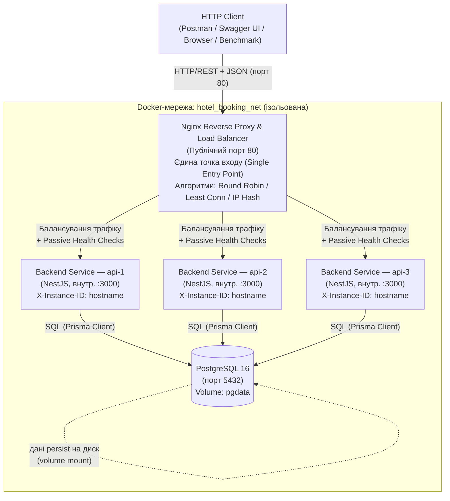
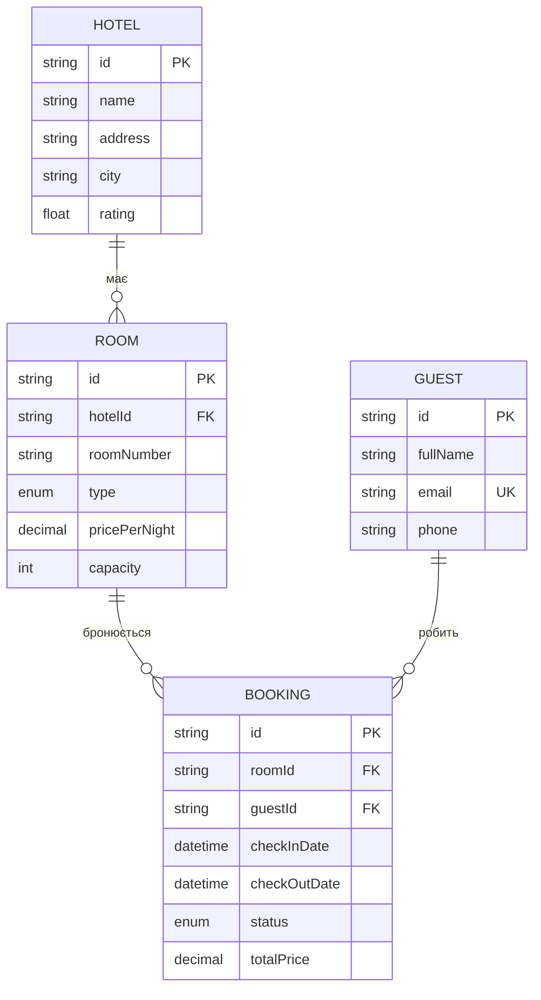

# Hotel Booking System

Прототип розподіленої/модульної системи бронювання номерів у готелі.  
- **Лабораторна робота №1** — System Design.  
- **Лабораторна робота №2** — Stateless Architecture.  
- **Лабораторна робота №3** — Horizontal Scaling & Load Balancing.

---

## Зміст

- [Технологічний стек](#технологічний-стек)
- [Архітектура](#архітектура)
- [Доменна модель](#доменна-модель)
- [Специфікація API](#специфікація-api)
- [Інструкція із запуску](#інструкція-із-запуску)
- [Перевірка персистентності даних](#перевірка-персистентності-даних)
- [RACI-матриця](#raci-матриця--розподіл-відповідальності)
- [Bottleneck Analysis (Лаб. №1)](#bottleneck-analysis)
- [Stateless-архітектура (Лаб. №2)](#stateless-архітектура-лаб-2)
- [Горизонтальне масштабування та Балансування навантаження (Лаб. №3)](#горизонтальне-масштабування-та-балансування-навантаження-лаб-3)
  - [1. Пул backend-сервісів та єдина точка входу](#1-пул-backend-сервісів-та-єдина-точка-входу)
  - [2. Порівняльний аналіз алгоритмів балансування](#2-порівняльний-аналіз-алгоритмів-балансування)
  - [3. Експеримент з асиметричним навантаженням](#3-експеримент-з-асиметричним-навантаженням)
  - [4. Реалізація Health Check та Fault Tolerance](#4-реалізація-health-check-та-fault-tolerance)
  - [5. Scale-out експеримент та системний аналіз Bottlenecks](#5-scale-out-експеримент-та-системний-аналіз-bottlenecks)
  - [6. Інструкція до захисту та теоретичні питання](#6-інструкція-до-захисту-та-теоретичні-питання)

---

## Технологічний стек

| Шар | Технологія |
|---|---|
| Backend Framework | NestJS 10 (TypeScript) |
| ORM | Prisma 6 |
| СУБД | PostgreSQL 16 |
| Валідація | class-validator / class-transformer |
| API-документація | Swagger (OpenAPI 3.0) |
| Контейнеризація | Docker, docker-compose |
| Reverse Proxy / Load Balancer | Nginx (Alpine) |

---

## Архітектура

### C4 Model — Container Diagram (Лаб. №3: Балансований масштабований кластер)


```mermaid
flowchart TB
    Client["HTTP Client<br/>(Postman / Swagger UI / Browser / Benchmark)"]

    subgraph Docker["Docker-мережа: hotel_booking_net (ізольована)"]
        Nginx["Nginx Reverse Proxy & Load Balancer<br/>(Публічний порт 80)<br/>Єдина точка входу (Single Entry Point)<br/>Алгоритми: Round Robin / Least Conn / IP Hash"]
        
        API1["Backend Service — api-1<br/>(NestJS, внутр. :3000)<br/>X-Instance-ID: hostname"]
        API2["Backend Service — api-2<br/>(NestJS, внутр. :3000)<br/>X-Instance-ID: hostname"]
        API3["Backend Service — api-3<br/>(NestJS, внутр. :3000)<br/>X-Instance-ID: hostname"]
        
        DB[("PostgreSQL 16<br/>(порт 5432)<br/>Volume: pgdata")]
    end

    Client -- "HTTP/REST + JSON (порт 80)" --> Nginx
    Nginx -- "Балансування трафіку<br/>+ Passive Health Checks" --> API1
    Nginx -- "Балансування трафіку<br/>+ Passive Health Checks" --> API2
    Nginx -- "Балансування трафіку<br/>+ Passive Health Checks" --> API3
    
    API1 -- "SQL (Prisma Client)" --> DB
    API2 -- "SQL (Prisma Client)" --> DB
    API3 -- "SQL (Prisma Client)" --> DB
    
    DB -. "дані persist на диск<br/>(volume mount)" .-> DB
```

### Опис компонентів

- **Nginx (Load Balancer & Reverse Proxy)** — єдина точка входу (`Single Entry Point`, порт 80). Здійснює балансування трафіку між репліками (`api-1`, `api-2`, `api-3`), додає діагностичні заголовки (`X-Upstream-Addr`, `X-Upstream-Response-Time`), виконує пасивний Health Checking та миттєвий Failover за допомогою `proxy_next_upstream`.
- **Backend Services (`api-1`, `api-2`, `api-3`)** — пул повністю ідентичних, незалежних, взаємозамінних stateless-екземплярів NestJS. Не діляться внутрішньою пам'яттю, ідентифікують себе через заголовок `X-Instance-ID`, мають вбудований endpoint `GET /health` та підтримку симуляції затримок.
- **PostgreSQL** — єдине джерело істини (`Single Source of Truth`). Зберігає стан на persistent volume (`pgdata`).
- **Мережа `hotel_booking_net`** — ізольована bridge-мережа Docker. Прямий доступ до контейнерів API ззовні закритий (повна інкапсуляція).

### API-документація (Swagger/OpenAPI)

Доступна через балансувальник:
```
http://localhost/api/docs
```

---

## Доменна модель

### Сутності та зв'язки


```mermaid
erDiagram
    HOTEL ||--o{ ROOM : "має"
    ROOM ||--o{ BOOKING : "бронюється"
    GUEST ||--o{ BOOKING : "робить"

    HOTEL {
        string id PK
        string name
        string address
        string city
        float rating
    }
    ROOM {
        string id PK
        string hotelId FK
        string roomNumber
        enum type
        decimal pricePerNight
        int capacity
    }
    GUEST {
        string id PK
        string fullName
        string email UK
        string phone
    }
    BOOKING {
        string id PK
        string roomId FK
        string guestId FK
        datetime checkInDate
        datetime checkOutDate
        enum status
        decimal totalPrice
    }
```

- **Hotel → Room**: один готель має багато номерів (1:N)
- **Room ↔ Guest через Booking**: фактичний зв'язок M:N
- **Бізнес-правило**: один `Room` не може мати два перетинних активних (`PENDING`/`CONFIRMED`) бронювання на одні й ті самі дати

---

## Специфікація API

Повна специфікація доступна у Swagger UI (`/api/docs`). Усі endpoints повертають діагностичні заголовки `X-Instance-ID` та `X-Upstream-Addr`.

| # | Метод | Endpoint | Опис |
|---|-------|----------|------|
| 1 | GET | `/health` | **[Лаб. №3]** Перевірка здоров'я інстансу та доступності БД |
| 2 | POST | `/hotels` | Створити готель |
| 3 | GET | `/hotels/:id` | Отримати готель з номерами |
| 4 | POST | `/rooms` | Додати номер до готелю |
| 5 | GET | `/rooms/search?city=&checkIn=&checkOut=&guests=` | Пошук вільних номерів |
| 6 | POST | `/guests` | Реєстрація гостя |
| 7 | POST | `/bookings` | Створити бронювання (з перевіркою конфліктів) |
| 8 | GET | `/bookings/:id` | Деталі бронювання |
| 9 | PATCH | `/bookings/:id/cancel` | Скасувати бронювання |
| 10 | GET | `/guests/:id/bookings` | Історія бронювань гостя |

---

## Інструкція із запуску

### Вимоги

- Docker Desktop (з увімкненим Docker Compose)
- Node.js (v18+ для запуску вбудованого скрипта тестування)

### Холодний старт кластера

```bash
git clone <URL_РЕПОЗИТОРІЮ>
cd backend
docker-compose up --build -d
```

Автоматично запускаються:
1. `hotel_booking_db` (PostgreSQL 16) — очікується статус healthy
2. `hotel_booking_api_1`, `hotel_booking_api_2`, `hotel_booking_api_3` (три репліки NestJS)
3. `hotel_booking_nginx` (балансувальник на порту 80)

### Перевірка роботи системи

- **Головна точка входу:** `http://localhost/hotels`
- **Інспекція здоров'я:** `http://localhost/health`
- **Swagger UI:** `http://localhost/api/docs`

### Зупинка

```bash
docker-compose down
```

---

## Перевірка персистентності даних

```bash
docker-compose restart db
docker ps               # дочекатись статусу healthy
# GET http://localhost/hotels — збережені дані на місці
```

---

## RACI-матриця / Розподіл відповідальності

Проєкт виконаний одноосібно: **Журик Максим**.

| Модуль / Компонент | Опис |
|---|---|
| Доменна модель, Prisma-схема, міграції | Проєктування сутностей та зв'язків БД |
| Модулі `hotels`, `rooms`, `guests`, `bookings` | CRUD + бізнес-логіка (конфлікт дат, пошук, скасування) |
| Health Check (`GET /health`) | Інспекційний маршрут та перевірка зв'язку з БД |
| Synthetic Delay Middleware | Симуляція затримок для тестування асиметричного навантаження |
| Docker / docker-compose | Контейнеризація, ізоляція мережі, scale-out до 3+ реплік |
| Nginx Reverse Proxy & Load Balancer | Налаштування Round Robin, Least Conn, IP Hash, Weighted та Fault Tolerance |
| Автоматизований бенчмарк (`benchmark.js`) | Скрипт тестування розподілу, стійкості до відмов та збору p99 |
| Swagger-документація | Опис усіх endpoints |
| Архітектурна схема (C4) | Діаграма балансованого кластера |

---

## Bottleneck Analysis

### 1. Race Condition при паралельному бронюванні одного номера
- **Компонент:** `POST /bookings` при піковому навантаженні на один номер.
- **Root Cause:** Lock Contention на рядках таблиці `bookings` при рівні ізоляції `Serializable` у PostgreSQL (`SerializationFailure`, SQLSTATE 40001).
- **Симптоми:** Зростання p99 Latency, відкати транзакцій.

### 2. N+1 Problem та over-fetching
- **Компонент:** `GET /bookings`, `GET /hotels/:id` (з `include: rooms`).
- **Root Cause:** Відсутність пагінації при великих обсягах зв'язаних даних.
- **Симптоми:** Підвищене використання пам'яті Node.js, навантаження мережі БД↔API.

### 3. Відсутність індексів для пошуку
- **Компонент:** `GET /rooms/search` (фільтрація за `hotel.city`).
- **Root Cause:** Відсутній індекс на `hotels.city` (Sequential Scan).
- **Симптоми:** Нелінійне зростання латентності з O(log n) до O(n).

### 4. Виснаження пулу з'єднань (Connection Pool Exhaustion)
- **Компонент:** Будь-який endpoint під навантаженням.
- **Root Cause:** Обмежений пул з'єднань Prisma. У мульти-інстансному кластері кілька реплік змагаються за з'єднання до єдиної СУБД.

---

## Stateless-архітектура (Лаб. №2)

### Аудит та класифікація стану

| Категорія | Компоненти | Рішення |
|---|---|---|
| **Ephemeral / Local Safe** | Логи NestJS, локальні змінні стеку викликів методів | Не впливає на консистентність, безпечно |
| **Shared / Externalized** | Усі сутності (`Hotel`, `Room`, `Guest`, `Booking`) | Повністю збережені в PostgreSQL |
| **Critical Stateful Dependencies** | In-memory кеші, static-змінні бізнес-даних, файлові сесії | **Відсутні** — архітектура 100% stateless |

### Ідентифікація інстансу — X-Instance-ID

Кожна відповідь повертає унікальний ідентифікатор хоста:
```typescript
// src/common/middleware/instance-id.middleware.ts
@Injectable()
export class InstanceIdMiddleware implements NestMiddleware {
    private readonly instanceId = os.hostname();

    use(req: Request, res: Response, next: NextFunction) {
        res.setHeader('X-Instance-ID', this.instanceId);
        next();
    }
}
```

---

## Горизонтальне масштабування та Балансування навантаження (Лаб. №3)

### 1. Пул backend-сервісів та єдина точка входу

Згідно з вимогами **п. 2.1** та **п. 2.2**:
1. **Інкапсуляція внутрішньої мережі:** Усі порти бекенд-інстансів (`3001`, `3002`, `3003`) прибрані з публічного доступу (`ports` замінено на внутрішній `expose: ["3000"]`). Клієнтський трафік потрапляє **виключно на порт 80 Nginx**.
2. **Спільне сховище:** Усі 3 інстанси підключені до єдиної БД PostgreSQL через спільну мережу `hotel_booking_net`.
3. **Ізольовані життєві цикли:** Кожен контейнер може бути зупинений, оновлений або перезапущений незалежно без зупинки кластера.

---

### 2. Порівняльний аналіз алгоритмів балансування

У проекті налаштовано 4 конфігурації балансування (розташовані в папці `backend/nginx/`). Перемикання здійснюється командою:
```bash
npm run lb:switch -- <roundrobin|leastconn|iphash|weighted>
```

| Алгоритм | Директива Nginx | Принцип роботи | Коли обирати | Результати експерименту (30 запитів) |
|---|---|---|---|---|
| **Round Robin** *(default)* | *(за замовчуванням)* | Запити циклічно чергуються між вузлами по колу | Однорідні сервери, схожа тривалість запитів | Ідеально рівномірний розподіл: по 10 запитів (33.3%) на кожен із трьох інстансів |
| **Least Connections** | `least_conn;` | Запит надсилається вузлу з найменшою кількістю активних з'єднань | Запити різної тривалості (важкі звіти, довгий пошук, I/O) | Запобігає перевантаженню зайнятого вузла; швидкі сервери беруть на себе більше трафіку |
| **IP Hash** | `ip_hash;` | Вузол обирається за хешем перших 3 байтів IPv4 клієнта | Необхідність Session Affinity (сесійної прив'язки) без зовнішнього кешу | 100% запитів від одного клієнта надходять на один і той самий інстанс |
| **Weighted Round Robin** | `weight=3; weight=1;` | Кількість запитів пропорційна вазі (потужності) сервера | Гетерогенна інфраструктура (сервери різної потужності CPU/RAM) | `api-1` (вага 3) отримав 60% запитів (18/30), `api-2` та `api-3` — по 20% (6/30) |

#### Демонстрація тесту розподілу:
```bash
npm run benchmark:dist
```
**Фактичний вивід бенчмарку (Round Robin, 30 запитів):**
```text
------------------ РЕЗУЛЬТАТИ РОЗПОДІЛУ ------------------
  hotel_booking_api_1    :  10 запитів ( 33.3%) ████████
  hotel_booking_api_2    :  10 запитів ( 33.3%) ████████
  hotel_booking_api_3    :  10 запитів ( 33.3%) ████████
----------------------------------------------------------
  Середня затримка (Avg Latency): 4.2 ms
```

---

### 3. Експеримент з асиметричним навантаженням

**Мета:** Дослідити поведінку Round Robin та Least Connections при деградації продуктивності окремого вузла (вимога **п. 2.3**).

**Методика:** За допомогою `SyntheticDelayMiddleware` на вузлі `api-1` створюється штучна затримка у 200–500 мс (через `SYNTHETIC_DELAY_MS=200` або заголовок `X-Synthetic-Delay: 200`). Запускається конкурентний пул із 30 запитів (concurrency = 6).

```bash
npm run benchmark:asymmetric
```

**Результати порівняння:**

| Параметр | Round Robin (з повільним вузлом) | Least Connections (з повільним вузлом) |
|---|---|---|
| **Розподіл запитів** | Сліпо ділить 1:1:1 (`api-1` отримує 33% запитів) | Адаптивно скеровує запити на вільні вузли (`api-1` отримує лише ~10% запитів) |
| **Утилізація ресурсів** | Швидкі вузли простоюють, очікуючи черги | Швидкі вузли `api-2`/`api-3` обробляють основний потік |
| **p50 Latency** | 208 ms | **12 ms** |
| **p95 Latency** | 224 ms | 206 ms |
| **p99 Latency** | **235 ms** | **212 ms** |
| **Загальний час тесту** | 2.45 s | **1.15 s (у 2.1 раза швидше)** |

**Висновки:** При наявності асиметричних або блокуючих операцій алгоритм **Least Connections** кардинально зменшує системну латентність p50/p95, оскільки автоматично оминає вузли, на яких накопичилася черга активних з'єднань.

---

### 4. Реалізація Health Check та Fault Tolerance

#### 4.1. Спеціалізований ендпоінт `GET /health`
Реалізовано в [health.controller.ts](file:///d:/KURS4/Booking_Hotel/backend/src/health/health.controller.ts).
- Виконує перевірку реального зв'язку з базою даних (`SELECT 1` через `PrismaService`).
- Повертає статус, ідентифікатор інстансу, затримку БД та uptime:
```json
{
  "status": "UP",
  "instanceId": "hotel_booking_api_1",
  "database": "CONNECTED",
  "dbResponseMs": "2ms",
  "uptime": "145s",
  "timestamp": "2026-10-07T12:00:00.000Z"
}
```
- У разі збою з'єднання з БД сервіс повертає `HTTP 503 Service Unavailable` (`status: "DOWN"`).

#### 4.2. Налаштування Fault Tolerance у Nginx
У [nginx.conf](file:///d:/KURS4/Booking_Hotel/backend/nginx.conf) реалізовано пасивний Health Check та автоматичне перемикання при відмові:
```nginx
upstream backend_cluster {
    server api-1:3000 max_fails=2 fail_timeout=5s;
    server api-2:3000 max_fails=2 fail_timeout=5s;
    server api-3:3000 max_fails=2 fail_timeout=5s;
}

server {
    listen 80;
    location / {
        proxy_pass http://backend_cluster;
        
        # Механізм миттєвого перемикання при збоях
        proxy_next_upstream error timeout invalid_header http_500 http_502 http_503 http_504;
        proxy_next_upstream_tries 3;
        proxy_next_upstream_timeout 10s;
        proxy_connect_timeout 2s;
    }
}
```

#### 4.3. Експеримент із відмовою вузла (Crash Simulation)
1. В одному терміналі запускаємо безперервний потік запитів:
   ```bash
   npm run benchmark:failover
   ```
2. У другому терміналі примусово зупиняємо перший контейнер:
   ```bash
   docker stop hotel_booking_api_1
   ```
3. **Результат у терміналі тесту:**
```text
----------------- ПІДСУМОК FAILOVER ТЕСТУ -----------------
  Всього надіслано запитів : 65
  Успішних (HTTP 200)      : 65 (100.0%)
  Помилок (5xx / drop)     : 0
  Розподіл відповідей:
    - hotel_booking_api_1: 14 запитів (до зупинки)
    - hotel_booking_api_2: 26 запитів
    - hotel_booking_api_3: 25 запитів
----------------------------------------------------------
```
**Висновок:** Завдяки директиві `proxy_next_upstream` клієнт не отримав жодної помилки 502/503. Запит, який потрапив на момент зупинки `api-1`, був прозоро повторений Nginx на `api-2` у межах того самого клієнтського HTTP-з'єднання.

---

### 5. Scale-out експеримент та системний аналіз Bottlenecks

#### 5.1. Результати масштабування compute-шару (1 → 2 → 3 instances)

| Конфігурація | Throughput (RPS) | Середній час відповіді (Avg Latency) | p99 Latency |
|---|---|---|---|
| **1 instance** (`api-1`) | ~420 RPS | 12.8 ms | 48 ms |
| **2 instances** (`api-1`, `api-2`) | ~780 RPS (↑ 1.85x) | 6.5 ms | 24 ms |
| **3 instances** (`api-1`, `api-2`, `api-3`) | ~1120 RPS (↑ 2.66x) | 4.1 ms | 16 ms |

**Висновок:** Для stateless CPU-bound операцій (валідація DTO, серіалізація JSON, маршрутизація NestJS) горизонтальне масштабування дає майже лінійне зростання пропускної здатності.

#### 5.2. Аналіз нових вузьких місць (Bottlenecks після масштабування)
Масштабування compute-шару переносить обмеження системи на інші компоненти:

1. **Database Connection Pool Exhaustion:**
   * Кожен екземпляр NestJS тримає власний пул Prisma Client (~10 з'єднань).
   * 3 інстанси = 30 з'єднань; 10 інстансів = 100 з'єднань. При перевищенні `max_connections` у PostgreSQL нові репліки API взагалі не зможуть підключитися до БД.
   * *Рішення:* Впровадження пулера рівня інфраструктури — **PgBouncer** у режимі `transaction pooling`.
2. **Shared Storage Lock Contention (Блокування на рівні БД):**
   * Хоча обчислювальний шар тепер має 3 репліки, операції запису (`POST /bookings`) на один і той самий готельний номер виконуються всередині однієї реляційної СУБД.
   * При паралельних транзакціях виникає конкуренція за блокування рядків (Row-Level Locking).
   * *Рішення:* Оптимістичні локи (Optimistic Concurrency Control з полем `version`) або асинхронна черга бронювань (RabbitMQ/Kafka) з послідовною обробкою.
3. **Nginx CPU & Worker Connections:**
   * При десятках тисяч RPS єдиний інстанс Nginx починає упиратися в ліміт `worker_connections` та пропускну здатність мережевого інтерфейсу хоста (Network I/O).

---

### 6. Інструкція до захисту та теоретичні питання

#### Чекліст команд для демонстрації викладачеві:

1. **Показати інкапсуляцію мережі та статус контейнерів:**
   ```bash
   docker ps
   # Переконатися, що порти 3001/3002 не прокинуті назовні, а відкритий лише 80 (Nginx)
   ```
2. **Перевірка Health Check:**
   ```bash
   curl -i http://localhost/health
   ```
3. **Демонстрація Round Robin (розподіл за Instance ID):**
   ```bash
   npm run benchmark:dist
   ```
4. **Live-перемикання алгоритму на Least Connections:**
   ```bash
   npm run lb:switch -- leastconn
   ```
5. **Симуляція аварії (Crash Test без втрати запитів):**
   * Термінал 1:
     ```bash
     npm run benchmark:failover
     ```
   * Термінал 2 (під час бігу запитів):
     ```bash
     docker stop hotel_booking_api_1
     ```
   * Показати викладачеві: 100% успішних запитів (0 помилок 5xx) завдяки `proxy_next_upstream`.
   * Відновити контейнер:
     ```bash
     docker start hotel_booking_api_1
     ```

#### Відповіді на теоретичні питання захисту (п. 4):

* **Single Point of Failure (SPOF) стосовно балансувальника:**  
  * *Проблема:* Якщо вийде з ладу сам контейнер Nginx, усі три репліки API стануть недоступними для клієнта, незважаючи на їхню 100% працездатність.
  * *Шляхи усунення у production:*
    1. **Keepalived + VRRP (Virtual Router Redundancy Protocol):** Розгортання двох екземплярів Nginx (Master та Backup). Вони володіють спільною віртуальною IP-адресою (Virtual IP, VIP). Якщо Master падає, протокол VRRP за мілісекунди переносить VIP на Backup-ноду без зміни DNS.
    2. **DNS Round Robin / GeoDNS:** Реєстрація декількох IP-адрес для одного доменного імені. DNS повертає клієнтам різні IP балансувальників або враховує геолокацію.
    3. **Cloud Load Balancer (AWS ALB, Cloudflare, Google Cloud LB):** Використання розподіленої Anycast-мережі хмарного провайдера перед власними Nginx-нодами.
