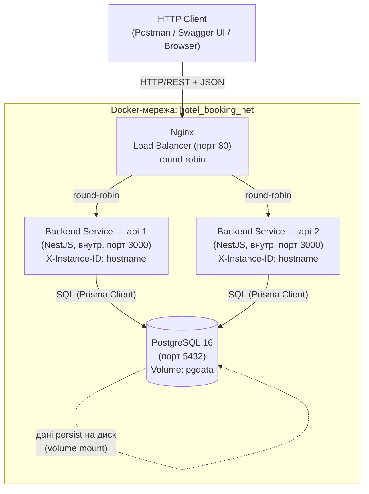
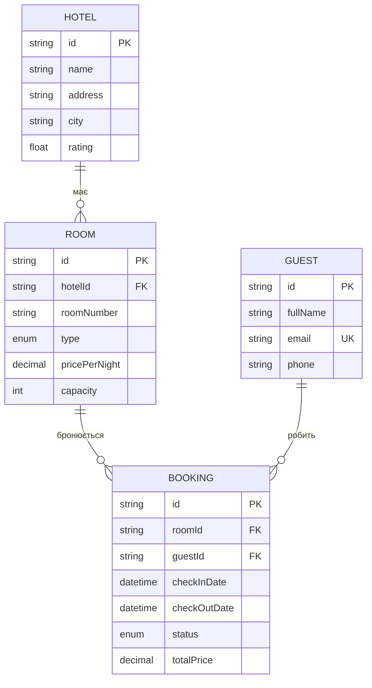

# Hotel Booking System

Прототип розподіленої/модульної системи бронювання номерів у готелі.
Лабораторна робота №1 — System Design.
Лабораторна робота №2 — Stateless Architecture.

## Зміст

- [Технологічний стек](#технологічний-стек)
- [Архітектура](#архітектура)
- [Доменна модель](#доменна-модель)
- [Специфікація API](#специфікація-api)
- [Інструкція із запуску](#інструкція-із-запуску)
- [Перевірка персистентності даних](#перевірка-персистентності-даних)
- [RACI-матриця](#raci-матриця--розподіл-відповідальності)
- [Bottleneck Analysis](#bottleneck-analysis)
- [Stateless-архітектура (Лаб. №2)](#stateless-архітектура-лаб-2)

---

## Технологічний стек

| Шар | Технологія |
|---|---|
| Backend Framework | NestJS (TypeScript) |
| ORM | Prisma 6 |
| СУБД | PostgreSQL 16 |
| Валідація | class-validator / class-transformer |
| API-документація | Swagger (OpenAPI 3.0) |
| Контейнеризація | Docker, docker-compose |
| Load Balancer | Nginx |

---

## Архітектура

### C4 Model — Container Diagram (актуальна, мульти-інстансна)


```mermaid
flowchart TB
    Client["HTTP Client<br/>(Postman / Swagger UI / Browser)"]

    subgraph Docker["Docker-мережа: hotel_booking_net"]
        Nginx["Nginx<br/>Load Balancer (порт 80)<br/>round-robin"]
        API1["Backend Service — api-1<br/>(NestJS, внутр. порт 3000)<br/>X-Instance-ID: hostname"]
        API2["Backend Service — api-2<br/>(NestJS, внутр. порт 3000)<br/>X-Instance-ID: hostname"]
        DB[("PostgreSQL 16<br/>(порт 5432)<br/>Volume: pgdata")]
    end

    Client -- "HTTP/REST + JSON" --> Nginx
    Nginx -- "round-robin" --> API1
    Nginx -- "round-robin" --> API2
    API1 -- "SQL (Prisma Client)" --> DB
    API2 -- "SQL (Prisma Client)" --> DB
    DB -. "дані persist на диск<br/>(volume mount)" .-> DB
```

### Опис компонентів

- **Nginx** — єдина точка входу ззовні (порт 80). Розподіляє вхідні запити між інстансами `api-1`/`api-2` за алгоритмом round-robin; клієнт ніколи не звертається до конкретного інстансу напряму.
- **Backend Service (api-1, api-2)** — дві однакові, незалежні, взаємозамінні копії одного образу NestJS-застосунку. Не спілкуються одна з одною і не діляться пам'яттю — увесь спільний стан живе виключно в PostgreSQL.
- **PostgreSQL** — єдине спільне джерело істини (single source of truth) для всіх інстансів. Дані зберігаються на persistent volume (`pgdata`).
- **Мережа `hotel_booking_net`** — ізольована bridge-мережа Docker; усі сервіси звертаються одне до одного за іменами (`db:5432`, `api-1:3000`, `api-2:3000`), без прив'язки до `localhost`.

### API-документація (Swagger/OpenAPI)

Через Nginx:
```
http://localhost/api/docs
```

---

## Доменна модель

### Сутності та зв'язки


```mermaid
erDiagram
    HOTEL ||--o{ ROOM : "має"
    ROOM ||--o{ BOOKING : "бронюється"
    GUEST ||--o{ BOOKING : "робить"

    HOTEL {
        string id PK
        string name
        string address
        string city
        float rating
    }
    ROOM {
        string id PK
        string hotelId FK
        string roomNumber
        enum type
        decimal pricePerNight
        int capacity
    }
    GUEST {
        string id PK
        string fullName
        string email UK
        string phone
    }
    BOOKING {
        string id PK
        string roomId FK
        string guestId FK
        datetime checkInDate
        datetime checkOutDate
        enum status
        decimal totalPrice
    }
```

- **Hotel → Room**: один готель має багато номерів (1:N)
- **Room ↔ Guest через Booking**: фактичний зв'язок M:N
- **Бізнес-правило**: один `Room` не може мати два перетинних активних (`PENDING`/`CONFIRMED`) бронювання на одні й ті самі дати

### High-Load сценарій

Масовий паралельний `POST /bookings` на один і той самий `roomId` — джерело навантаження, розглянуте в Bottleneck Analysis.

---

## Специфікація API

Повна інтерактивна специфікація — у Swagger UI (`/api/docs`). Усі endpoints додатково повертають заголовок `X-Instance-ID` (див. розділ Лаб. №2).

| # | Метод | Endpoint | Опис |
|---|-------|----------|------|
| 1 | POST | `/hotels` | Створити готель |
| 2 | GET | `/hotels/:id` | Отримати готель з номерами |
| 3 | POST | `/rooms` | Додати номер до готелю |
| 4 | GET | `/rooms/search?city=&checkIn=&checkOut=&guests=` | Пошук вільних номерів |
| 5 | POST | `/guests` | Реєстрація гостя |
| 6 | POST | `/bookings` | Створити бронювання |
| 7 | GET | `/bookings/:id` | Деталі бронювання |
| 8 | PATCH | `/bookings/:id/cancel` | Скасувати бронювання |
| 9 | GET | `/guests/:id/bookings` | Історія бронювань гостя |

---

## Інструкція із запуску

### Вимоги

- Docker Desktop (з увімкненим Docker Compose)

### Холодний старт (єдина команда, мульти-інстансний стек)

```bash
git clone <URL_РЕПОЗИТОРІЮ>
cd backend
docker-compose up --build
```

Автоматично піднімає: `db` (PostgreSQL) → `api-1` та `api-2` (два незалежні інстанси NestJS) → `nginx` (балансувальник на порту 80).

### Перевірка роботи

- API (через балансувальник): `http://localhost/hotels`
- Swagger UI: `http://localhost/api/docs`
- Прямий доступ до конкретного інстансу (для тестування — не для продакшену): `http://localhost:3001` (api-1), `http://localhost:3002` (api-2)

### Зупинка

```bash
docker-compose down
```

---

## Перевірка персистентності даних

```bash
docker-compose restart db
docker ps               # дочекатись статусу healthy
# GET /hotels — раніше створені дані на місці
```

---

## RACI-матриця / Розподіл відповідальності

Проєкт виконаний одноосібно: **Журик Максим**.

| Модуль / Компонент | Опис |
|---|---|
| Доменна модель, Prisma-схема, міграції | Проєктування сутностей та зв'язків БД |
| Модулі `hotels`, `rooms`, `guests`, `bookings` | CRUD + бізнес-логіка (конфлікт дат, пошук, скасування) |
| Docker / docker-compose / Dockerfile | Контейнеризація, мережа, healthcheck |
| Nginx + мульти-інстансне розгортання | Load balancing, X-Instance-ID, resilience testing |
| Swagger-документація | Опис усіх endpoints |
| Bottleneck Analysis | Аналіз точок деградації системи |
| Архітектурна схема (C4) | Діаграма контейнерів (оновлена для Лаб. №2) |

---

## Bottleneck Analysis

### 1. Race Condition при паралельному бронюванні одного номера

- **Компонент / Операція / Запит:** `POST /bookings` — одночасні запити на бронювання одного й того самого `roomId` на дати, що перетинаються.
- **Причина (Root Cause):** Транзакція з рівнем ізоляції `Serializable` — PostgreSQL при конфлікті серіалізації відхиляє одну з конкурентних транзакцій (`SerializationFailure`, SQLSTATE 40001). Lock Contention на рівні рядків таблиці `bookings`.
- **Симптоматика та прояв:** Зростання Latency p99; падіння Throughput/RPS; помилки `could not serialize access due to concurrent update`.

### 2. N+1 Problem та over-fetching при отриманні вкладених даних

- **Компонент / Операція / Запит:** `GET /bookings`, `GET /hotels/:id`, `GET /guests/:id/bookings`.
- **Причина (Root Cause):** Відсутність пагінації при зростанні обсягу пов'язаних даних (over-fetching).
- **Симптоматика та прояв:** Зростання Latency p99 пропорційно обсягу даних; підвищене використання пам'яті Node.js.

### 3. Відсутність індексів при масштабуванні пошуку

- **Компонент / Операція / Запит:** `GET /rooms/search` (фільтрація за `hotel.city`).
- **Причина (Root Cause):** Відсутній індекс на `hotels.city` — Sequential Scan замість Index Scan.
- **Симптоматика та прояв:** Нелінійне зростання латентності; підвищена утилізація CPU БД.

### 4. Виснаження пулу з'єднань (Connection Pool Exhaustion)

- **Компонент / Операція / Запит:** Будь-який endpoint під час пікового навантаження.
- **Причина (Root Cause):** Обмежений пул з'єднань Prisma (~10–13); `Serializable`-транзакції утримують з'єднання довше.
- **Симптоматика та прояв:** Timeout-помилки `Timed out fetching a new connection from the pool`; Throughput/RPS виходить на плато.

**У мульти-інстансному розгортанні (Лаб. №2) ці ризики зростають**: два інстанси `api-1`/`api-2` ділять один і той самий пул з'єднань БД і одну й ту саму таблицю `bookings` — конкуренція за з'єднання та lock contention відбувається тепер **між процесами**, а не тільки між паралельними запитами всередині одного процесу.

### Можливі напрями оптимізації

- Оптимістичні локи (`version`-поле) замість `Serializable`-транзакцій
- Індекс на `hotels.city`, пагінація для списків
- PgBouncer для спільного пулу з'єднань між кількома інстансами `api`
- Redis-кешування результатів пошуку вільних номерів

---

## Stateless-архітектура (Лаб. №2)

### Аудит та класифікація стану

| Категорія | Що саме | Рішення |
|---|---|---|
| **Ephemeral / Local Safe** | Логи NestJS (Logger), тимчасові змінні всередині одного запиту (напр. `checkIn`/`checkOut` у `bookings.service.ts`, парсинг DTO) | Залишено як є — не впливає на консистентність, не переживає запит |
| **Shared / Externalized** | Уся бізнес-модель — `Hotel`, `Room`, `Guest`, `Booking` | Вже повністю в PostgreSQL з Лаб. №1 — жодних змін не знадобилось |
| **Critical Stateful Dependencies** | Перевірено весь код на: in-memory масиви/Map з бізнес-даними, `static`-поля класів, файлові сесії, локальні кеші, application-level locks | **Не знайдено жодного** — `PrismaService` є singleton, але зберігає лише пул з'єднань до БД, не бізнес-дані |

**Висновок аудиту:** застосунок від початку (Лаб. №1) спроєктований stateless — увесь бізнес-стан живе в PostgreSQL. Рефакторинг коду (п.2.2) не знадобився; робота Лаб. №2 полягала в **доведенні** цієї властивості через мульти-інстансне розгортання та явну ідентифікацію інстансів.

### Ідентифікація інстансу — X-Instance-ID

Кожна HTTP-відповідь містить заголовок `X-Instance-ID`, що дорівнює `hostname` контейнера (Docker призначає кожному контейнеру унікальний hostname автоматично):

```typescript
// src/common/middleware/instance-id.middleware.ts
@Injectable()
export class InstanceIdMiddleware implements NestMiddleware {
  private readonly instanceId = os.hostname();

  use(req: Request, res: Response, next: NextFunction) {
    res.setHeader('X-Instance-ID', this.instanceId);
    next();
  }
}
```

Підключено глобально в `AppModule` через `configure(consumer: MiddlewareConsumer)` на всі маршрути (`forRoutes('*')`).

### Stateless Request Flow — приклад: `POST /bookings`

| Етап | Що відбувається |
|---|---|
| **1. Вхідні параметри** | `roomId`, `guestId`, `checkInDate`, `checkOutDate` — приходять у тілі запиту, ніяк не залежать від того, який інстанс їх отримав |
| **2. Читання контексту зі shared storage** | `tx.room.findUnique(...)`, `tx.booking.findFirst(...)` (перевірка конфлікту дат) — усе читається з PostgreSQL у момент обробки запиту, жодних локальних кешів |
| **3. Атомарна зміна стану у зовнішньому сховищі** | `tx.booking.create(...)` всередині `$transaction` з рівнем `Serializable` — зміна одразу й остаточно потрапляє в БД |
| **4. Відсутність залишкових мутацій у пам'яті процесу** | Після відправки HTTP-відповіді жодна змінна процесу не "пам'ятає" про це бронювання — весь контекст існував лише в межах виконання функції `create()` і був звільнений разом зі стеком виклику |

### Мульти-інстансне розгортання

`docker-compose.yml` піднімає **два незалежні інстанси** backend-застосунку (`api-1`, `api-2`) з одного Docker-образу, плюс **Nginx** як load balancer (round-robin) на порту 80:

```yaml
services:
  db:
    # PostgreSQL — єдине спільне сховище стану
    ...
  api-1:
    build: .
    environment:
      DATABASE_URL: "postgresql://postgres:postgres@db:5432/hotel_booking?schema=public"
    # порт 3001 відкритий тимчасово лише для прямого тестування інстансів
  api-2:
    build: .
    environment:
      DATABASE_URL: "postgresql://postgres:postgres@db:5432/hotel_booking?schema=public"
    # порт 3002 відкритий тимчасово лише для прямого тестування інстансів
  nginx:
    image: nginx:alpine
    ports:
      - "80:80"
    volumes:
      - ./nginx.conf:/etc/nginx/nginx.conf:ro
```

`nginx.conf`:
```nginx
events {}
http {
    upstream backend_cluster {
        server api-1:3000;
        server api-2:3000;
    }
    server {
        listen 80;
        location / {
            proxy_pass http://backend_cluster;
        }
    }
}
```

**Перевірка чергування інстансів** (кілька послідовних запитів на `http://localhost/hotels` через Postman):

| Запит | X-Instance-ID |
|---|---|
| 1 | `bb4893729c24` |
| 2 | `743e9ed223d0` |

Різні значення підтверджують, що Nginx реально розподіляє навантаження між обома інстансами.

### Cross-Instance Consistency Testing

Сценарій виконаний з прямим зверненням до кожного інстансу в обхід балансувальника (`localhost:3001` = api-1, `localhost:3002` = api-2) для детермінованості демонстрації:

| # | Запит | Instance | X-Instance-ID | Результат |
|---|---|---|---|---|
| 1 | `POST /hotels` | api-1 (:3001) | `b281f689593c` | 201, готель створено (`rating: 0`) |
| 2 | `GET /hotels/:id` | api-2 (:3002) | `7ec00b0cbd94` | 200, той самий готель видно одразу |
| 3 | `PATCH /hotels/:id {rating: 5}` | api-2 (:3002) | — | 200, оновлено |
| 4 | `GET /hotels/:id` | api-1 (:3001) | — | 200, `rating: 5` — зміна з іншого інстансу видна миттєво |

**Висновок:** дані, створені або змінені на одному інстансі, миттєво доступні на іншому — без Sticky Sessions, без реплікації стану між процесами, лише завдяки спільній БД.

### Restart / Instance Loss Scenario

| # | Дія | Результат |
|---|---|---|
| 1 | `POST /hotels` через api-1 — створено готель `a3432dd1...` | 201 |
| 2 | `docker kill hotel_booking_api_1` (аварійна SIGKILL-зупинка) | api-1 вимкнений |
| 3 | `GET /hotels/:id` через api-2 | 200 — готель, створений через api-1, **на місці** (дані не в пам'яті процесу) |
| 4 | `POST /hotels` через api-2 (новий готель) | 201 — система продовжує обробляти запити |
| 5 | `GET /hotels` через Nginx (`localhost/hotels`) | 200 — обидва готелі повернуто; Nginx автоматично не направляє трафік на мертвий `api-1` (passive failover за замовчуванням) |
| 6 | `docker-compose up -d api-1` — відновлення інстансу | api-1 піднявся знову з **новим** `X-Instance-ID`, одразу бачить усі дані, включно зі створеними під час його простою |

**Висновок:** аварійна втрата одного інстансу не призводить до втрати бізнес-даних і не порушує роботу системи — другий інстанс продовжує обслуговувати запити без додаткового втручання (Fault Tolerance).

### Відповідь на теоретичне питання п.4

**Різниця між stateless-архітектурою та відсутністю даних взагалі:** stateless означає, що *конкретний екземпляр сервісу* не зберігає бізнес-стан у власній пам'яті між запитами — кожен запит самодостатній і обробляється однаково незалежно від того, який інстанс його отримав. Дані при цьому **існують** і **зберігаються** — просто в зовнішньому спільному сховищі (тут — PostgreSQL), а не локально в процесі. Це принципово відрізняється від відсутності персистентності даних: тут дані durable (переживають перезапуск і навіть аварійну втрату будь-якого окремого інстансу), просто не прив'язані до конкретного worker-процесу.

**Ризики прихованої affinity:** якщо десь у коді залишився прихований stateful-елемент (наприклад, in-memory кеш сесій, локальний rate-limiter, черга задач у пам'яті), система *зовні* виглядає stateless (є кілька інстансів, є балансувальник), але насправді клієнт отримає різну поведінку залежно від того, на який інстанс його спрямує балансувальник — це і є прихована affinity, яка проявляється тільки під навантаженням або при збоях і є дуже складною для діагностики в продакшені.
